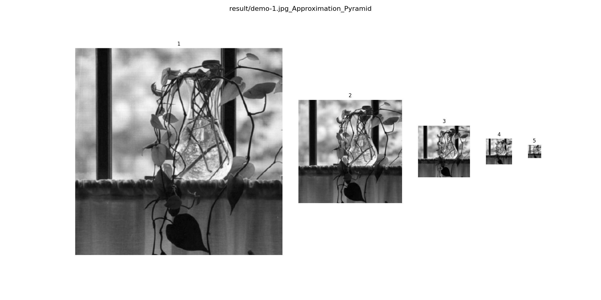

# Report for Homework 4, DIP 2024
**PB22061259 刘沛**
## Introduction
这次的作业是实现快速小波变换在图像处理领域的简单应用，包括：
**1.多分辨率分析中的近似金字塔与残差金字塔**
**2. 快速小波变换的实现**
**3. 快速小波变换在边缘检测中的应用**

## Method
### 1. 多分辨率分析中的近似金字塔与残差金字塔
先看多分辨率变换的流程图：

其中，近似滤波器采用了高斯滤波器，也就是opneCV中的cv2.GaussianBlur()函数。而对于线性插值滤波器，这里我将上采样和双线性插值合二为一，即通过对进过近似滤波和下采样的图像appro[j-1]通过双线性插值到原来的两倍得到appro[j]的估计值pred[j]。

与此同时appro[j]-pred[j]作为残差值加入到残差金字塔中。

### 2. 快速小波变换的实现
对于二维的快速小波变换，首先根据我们所采用的**小波种类**，会有一个滤波器系数$g_0$,然后根据这个系数，我们可以计算得到一个低通滤波器$h_0$和高通滤波器$h_1$。

对一个图像进行小波变换，将会得到一个尺度系数LL，和三个细节系数LH、HL、HH。尺度系数代表了图像的轮廓信息，即整体的、低频的信息；而细节系数分别代表了图像的水平细节、垂直细节、对角线细节信息。其中，对于尺度系数LL，我们可以看做是原图像的低分辨率版本，也就是多分辨率处理当中的一个原图像近似。

和这些系数名字相对应的是，每一次对图像的行或者列滤波将对应H：高通滤波器，L：低通滤波器。按照这个逻辑，我们可以对图像进行快速小波变换。而

接下来考虑高阶快速小波变换。对于高阶的快速小波变换，将第一次小波变换得到的尺度系数LL作为输入，然后对LL进行一次小波变换，得到尺度系数LL。循环这个过程，我们可以得到一个多尺度的小波变换金字塔。

### 3. 快速小波变换在边缘检测中的应用
首先，我们先了解如何由小波系数重建得到原图像。
其实，从第一个问题的多分辨率处理中我们可以了解到，想要由低分辨率图像重建到原图像，我们需要考虑将低分辨率图像的细节信息还原到原图像。也就是反向的滤波上采样求和过程。

而在这其中，如果我们只考虑细节系数而忽略尺度系数会怎么样呢？想象一下图像只有细节信息而没有轮廓信息，这不就是只保留了一张图像当中的高频部分吗！而图像当中的轮廓，正是一张图像当中灰度变换比较大的高频部分。

所以，如果我们只考虑细节系数，我们可以得到一张原图的边缘（包括水平和垂直）。
而我们如果再将图像当中的水平细节忽略，我们就得到了一张原图的水平边缘。

## Result
### 1. 多分辨率分析中的近似金字塔与残差金字塔

残差金字塔，好像是一张版画，只用凸起或者凹陷来刻画图像的边缘信息，而当中的色彩和亮度信息都丢失了。也就是说，残差金字塔只保留了图像的边缘信息。

### 2. 快速小波变换的实现

如图所示，小波变换的细节信息确实很明显的分为水平和垂直的高频信息。而尺度系数LL，则是图像一个模糊近似版本。

注意到图像其实有一些歪斜，在高阶的小波变换当中更为明显。我猜测是在卷积和采样的过程当中，没有很好的保证图像的对称性而是暴力直接进行两倍下采样，进而造成图像偏离中心。

而从小波系数恢复的原图可以看出，整个图像向右下角偏移了不少。

### 3. 快速小波变换在边缘检测中的应用

从小波系数恢复原图当中，控制忽略不同的尺度或者细节系数，我们可以得到图像水平或者垂直的高频信息。

## Discussion
在实现快速小波变换的编程的过程当中，虽然整体的算法思路不过就是分行分列进行低通高通滤波，但是具体实现的时候，我遇到了一些问题。

### 滤波器的选择
一开始我直接试着从书上抄$h_0,h_1$，但是具体实现是几乎没有滤波效果。后来选择从列表当中摘抄$g_0$，然后通过计算得到其他的滤波器系数，才实现了小波变换效果。
或许我之前抄错了吗?或者是书上的计算出现了问题。
### 上采样
这次实验所采用的的上采样的具体实现是双线性插值，和下采样不同的是，上采样实现起来比较麻烦，而且如果出错的话将会导致图片效果比较差，需要注意。