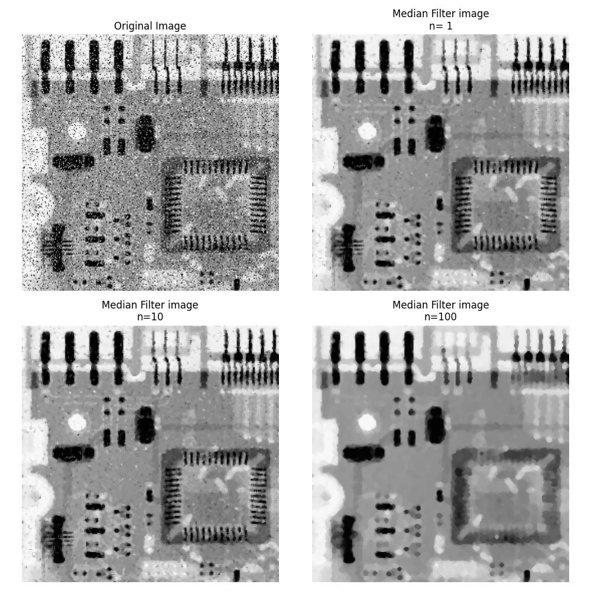

# DIP EXP2 Report

**PB22061250 LIUPEI**  
**2024.10.3**

## Instruction
第3章 灰度变换与空域滤波.  
在这一次的实验里面，进行直方图均衡化、空域滤波和锐化。

## Methods
### 直方图均衡化 Histogram Equalization
给定一副分辨率为𝑀 × 𝑁的灰度图象，灰度级为$r_k$的像素数为$𝑛_𝑘$，
该图像的归一化直方图：
$$p(r_k) = \frac{Nk}{M} = p(\frac{r_k}{M})$$
在python我们可以给出一个列表hist[$r_k$],用来记录每一个灰度级别的像素数量。即$$hist[k] = n_k,\quad \text{for} \quad k = 0, 1, 2, \ldots, r_k $$
    
直方图均衡化的数学公式：
$$s_k = T(r_k) = (L-1) \sum_{j=0}^{k} p_r(r_j) \quad \text{for} \quad k = 0, 1, 2, \ldots, L-1 $$
在python里面，我们可以根据hist来建立一个列表cdf[$r_k$],用来记录每一个灰度级别以下的所有像素数量，即$$cdf[k] = \sum_{j=0}^{k} p_r(r_j)$$

一般来说，原始灰度级别是256，至少在这道题目里面如此。我们可以根据当前像素点的灰度级别im[i,j],记为$r$那么这一点的新的灰度级别$r_{new}$将会是：$$r_{new} = (L-1)\frac{cdf[r]}{cdf[max]},\text{当然这里需要下取整}$$
这里可以根据这个新旧灰度级别映射关系整理得到一个列表lut[$r_k$]，后续可以根据lut进行新旧灰度级别映射，得到新的图片。  
但是这里有一个问题就是，新的灰度级该怎么映射到256个灰度取值上面呢？这里我直接采用线性映射的方法:L个灰度级，那么新的灰度：$$p_{new} = r_{new}×\frac{255}{L-1},\text{注意这里r已经是整数了}$$

### 均值滤波 Average Filtering
局部平均法是用某象素邻域内的**各点灰度的平均值**来代替该象素原来的灰度值。这里的**领域**，取奇数长度（定义为kernel_size）的正方形窗口（kernel_size×kernel_size的卷积核。
  
需要注意的是，一旦涉及到**卷积**操作，就一定需要注意边缘处理和填充。我在这一次的均值滤波处理当中，采用了复制填充的方法，将边缘根据卷积核的大小进行完全复制原图像素灰度值的填充方式。
  
在代码实现上面，我由于选取的卷积核是3×3大小的、不区分侧边和对角距离的，所以数学实现上没有采用卷积，而是直接利用numpy的**区域mean**直接计算。

### 中值滤波 Median Filterling
用局部邻域（窗口）里的中值来代替上述局部平均法中局部平均值。即将以该点为中心的某个窗口框住的各象素的中间值作为处理后图象中该点象素的值。

和均值滤波差不多，我也是选取的3×3的卷积核，只不过不是取平均，而是取中值**区域median**。

### 图像锐化（拉普拉斯算子）
一个连续的二元函数f(x,y),其拉普拉斯运算定义为：
$$\nabla^{2}f=\frac{\partial^{2}f}{\partial x^{2}}+\frac{\partial^{2}f}{\partial y^{2}}$$
也可以按卷积形式表示：
$$g(i,j)=\sum_{r=-ks=-l}^{k}\sum_{l}^{l}f(i-r,j-s)H(r,s),i,j=0,1,2,\sim N-1$$
其中K=1,I=1时H (r,s)取下式，得到一个3×3的卷积核：
$$\text{H1=}\left\{\begin{array}{ccc}0&-1&0\\-1&4&-1\\0&-1&0\end{array}\right\}$$
$$g(x,y)=\begin{cases}f(x,y)-\alpha\nabla^2f(x,y)\text{如果拉普拉斯掩模中心系数为负}\\f(x,y)+\alpha\nabla^2f(x,y)\text{如果拉普拉斯掩模中心系数为正}&\end{cases}$$
这里的$\alpha$是增强因子。
在这一部分的卷积操作当中，我选择了0填充，毕竟边缘的梯度不应该被人为填充的部分改变影响。

## Results
### 直方图均值化

第一个bidge图片原图比较暗淡，整个图片明显亮度不够，进行直方图均值化以后整个图片变亮了不少，图像观感有了较大的提升。而且值得注意的是，n=64与n=256对比可以得到，灰度级越多，显然图像的细节保留的也比较多，虽然这两幅图片的差别已经非常小了。n=2的情况几乎是一个二值化情况，但是丢失了非常多的细节。

第二幅moon的图片处理结果并没有很好，月亮周围明暗变化的边界出现了残影一样的效果。

第三幅图像看起来应该和moon一样，似乎并不需要进行均值化处理，所以处理完观感不如原图。

### 均值滤波

和老师上课讲的一样，对椒盐噪声进行均值滤波效果并没有很好，而且在滤波次数增加以后要图像的清晰度下降的非常厉害。

### 中值滤波

中值滤波的效果对于椒盐噪声非常不错，一次滤波以后图像当中的黑白点几乎就已经清楚的一干二净，而且清晰度损失也不是特别厉害。在滤波次数不断增加的时候，可以看得出来，噪声确实也在减小，不过与之相对应的是，图像的清晰度也在下降。所以，在进行滤波的时候，应该对噪声和清晰度之间做一个平衡。

### 图像锐化

可以看得出来，图像的边缘线条，在进行图像锐化增强以后确实变得清晰了不少。在这幅moon图片当中，好像看不出来什么副作用，也许别的图像副作用会比较明显。
