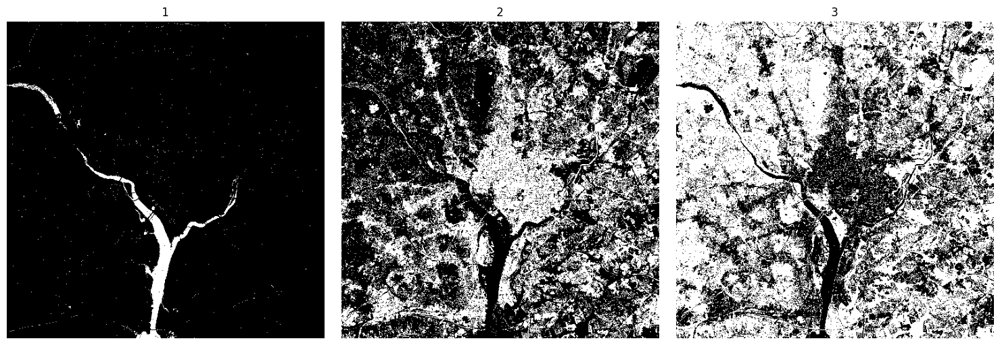

# Report of homework 6, DIP 2024
**PB22061259 刘沛**

## Introduction
这一次的任务是，使用高斯模式类的贝叶斯分类器来实现目标识别。

属于是有监督学习范畴，因为检测的目标会用模板给出。

## Method

### 贝叶斯分类器：
有j个模式类别，给出输入的特征$\mathbf{x}$, 贝叶斯分类器会计算每个类别的先验概率$p(\theta _j)$和条件概率$p(x|\theta _j)$，然后选择概率最大的类别作为输出。

$p_j(x|\theta _j) = \frac{p(x|\theta _j)p(\theta _j)}{p(x)} $

考虑到对于同一个输入特征$\mathbf{x}$，,每个分母都一样，所以这个公式可以简化为：

$d_j(x|\theta _j) = {p(x|\theta _j)p(\theta _j)}$

### 高斯分布模式类的贝叶斯分类器：

假设输入的特征$\mathbf{x}$服从高斯分布，即：

$p(x|\theta _j) = \frac{1}{(2\pi)^{\frac{d}{2}}|\Sigma _j|^{\frac{1}{2}}}exp(-\frac{1}{2}(x-\mu _j)^T\Sigma _j^{-1}(x-\mu _j))$

其中$\theta _j = (\mu _j,\Sigma _j)$是第j个高斯分布的均值和协方差矩阵，也就是第j个模式类别的概率分布模型。

### 训练过程：

输入的数据由四张图片堆叠而成，我们将每一个像素坐标作为一个样本，则这次实验的样本个数为$512 \times 512 $。
而我们将每个位置的可见蓝光、可见绿光、可见红光和近红外波长视为特征，共计4个特征。
> X = $[512 \times 512 , 4]$

而对于模板，我们有三个模板，分别对应(1)水体、(2)市区和(3)植被的样本区域的模板；每个模板相当于给出一定数量的样本标签。

训练过程就是根据已知的训练数据集，估计出每个模式类的概率分布模型。

具体地，假设训练数据集$\mathcal{D} = \{(x_1,y_1),\cdots,(x_N,y_N)\}$，其中$x_i \in \mathbb{R}^d$为输入特征，$y_i \in \{1,\cdots,j\}$为目标类别。

在这一次的实验当中，我们假设每个类别的先验概率$p(\theta _j)$都相同。

那么，我们可以计算每个类别的均值$\mu _j$和协方差矩阵$\Sigma _j$，如下：

> $\mu _j = \frac{1}{N_j}\sum_{i=1}^N\delta (y_i=j)x_i$，或者可以写为 $\mu _j = \frac{1}{N_j}\sum_{i\in C_j} x_i$

即模板对应位置的灰度均值。

而协方差矩阵$\Sigma _j$可以用如下公式计算：

> $\Sigma _j = \frac{1}{N_j}\sum_{i\in C_j}(x_i-\mu _j)^\top(x_i-\mu _j)$

### 预测过程

$\hat y = argmax_j d_j(x|\theta _j)$

则我们可以得到一张图像中各个部分被预测为各个类别的结果。

## Result

对于(1)水体、(2)市区和(3)植被的分类情况如下图所示：
