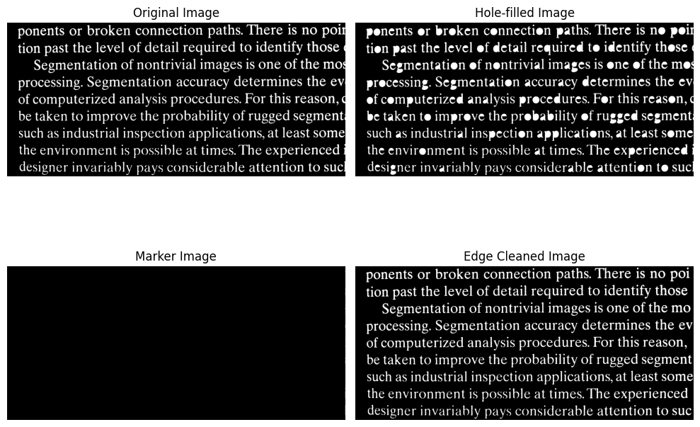
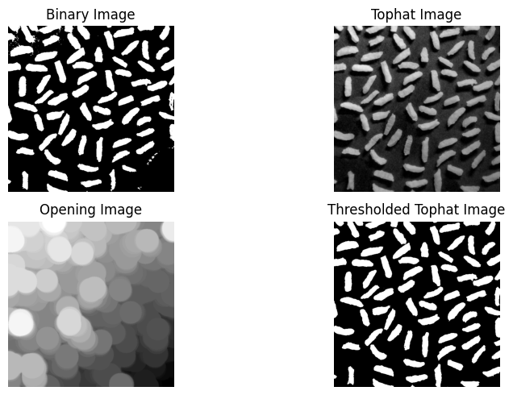
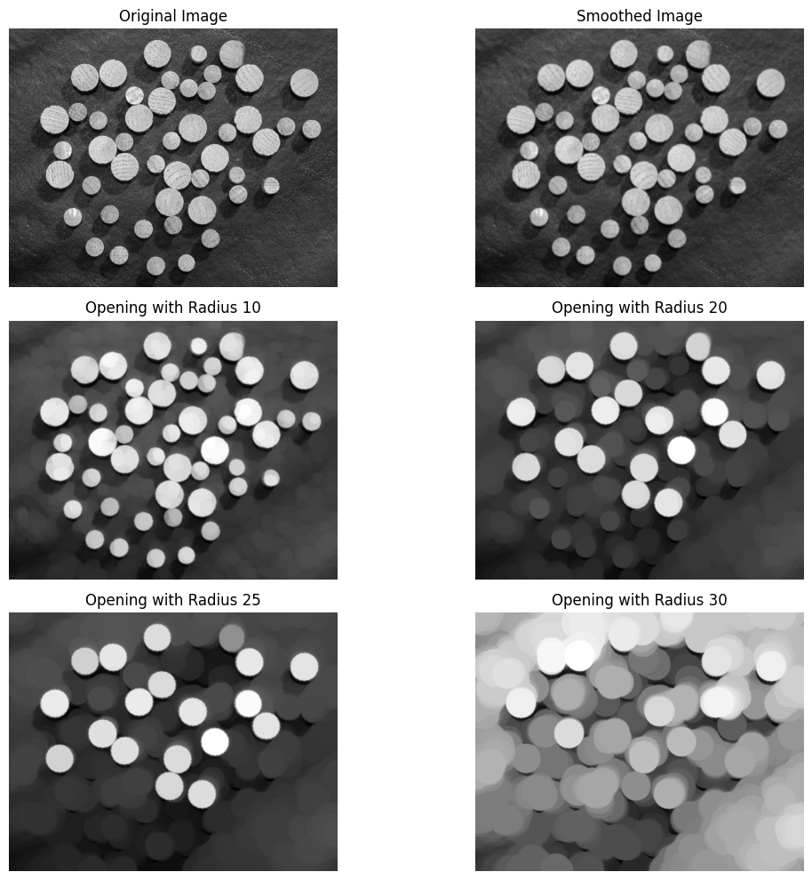
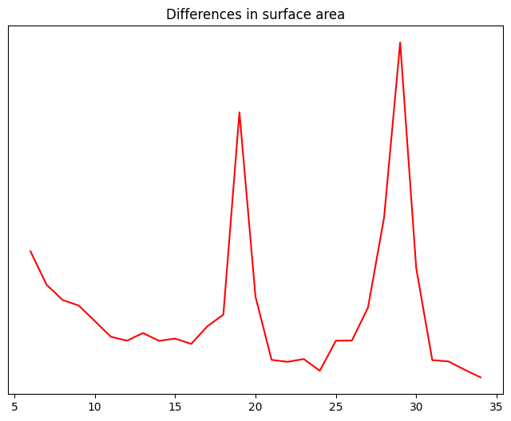
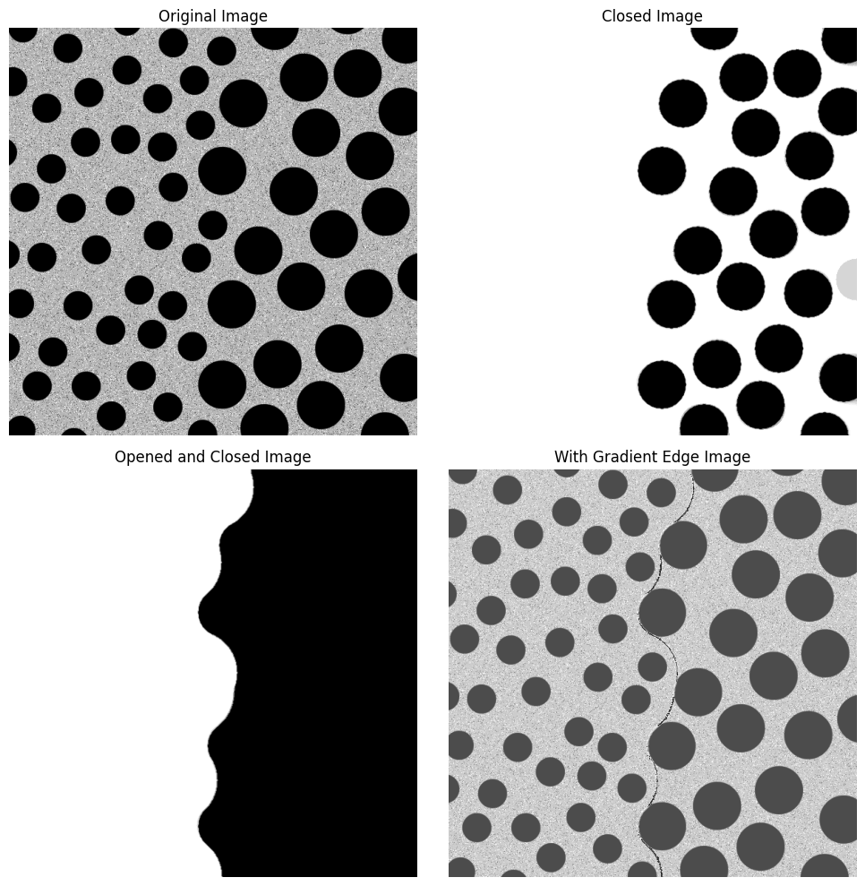

# Report of Homework 5,DIP 2024
**PB22061259,刘沛**

## Introduction
这次的作业是使用形态学操作来完成图像处理。

## Method：二值图像
### 1.Erosion
一个待腐蚀的二值图像A，以及一个腐蚀核Kernal：B。
$A\ominus B=\{z|(B)_Z\subseteq\mathbb{A}\}$
也相当于用腐蚀核Kernal遍历图像A的所有像素点，如果该像素点与腐蚀核Kernal的对应位置的像素点都相同，则该像素点保持不变，否则该像素点被置为0。
注意卷积核kernel
$
\begin{array}{ccc}
0 & 1 & \\
1 & 1&  \\
\end{array}
$
左上角为0代表这个像素位置可有可无不影响，也就是说，图像A中保留的是
$
\begin{array}{ccc}
0 & 1 & \\
1 & 1&  \\
\end{array}
$
或者
$
\begin{array}{ccc}
1 & 1 & \\
1 & 1&  \\
\end{array}
$
为了降低时间复杂度，可以利用库函数中的**卷积**操作，将腐蚀核Kernal与图像A卷积，得到的结果为convolved_image。而convolved_image[i,j]中的值是以img[i,j]为中心的区域region与kernel进行卷积的结果，如果convolved_image[i,j] = sum(kernel)*255,则说明region满足覆盖条件，置1，否则置为0。

### 2.Dilation
一个待膨胀的二值图像A，以及一个膨胀核Kernal：B。
$\mathcal{A}\bigoplus\mathcal{B}=\{\mathrm{z}|\left(\widehat{B}\right)_Z\cap\mathcal{A}\neq\emptyset\}$
相同的道理，只不过是region与kernel有交集，则该region被置1，否则被置为0。
考虑**卷积**操作:则convolved_image[i,j] >0,当且仅当region与kernel有交集，置1，否则置0。
### 3.Opening
先腐蚀再膨胀，得到的结果为A_open。
$A_{open} = A\circ B=(A\ominus B)\oplus B$
### 4.Closing
$\mathrm{A}\cdot\mathrm{B}=(\mathrm{A}\oplus\mathrm{B})\ominus B$
先膨胀再腐蚀，得到的结果为A_close。
### 膨胀形态学重建
$R_G^D(F)=D_G^{(k)}(F)$
来自标记图像F对模板图像G的膨胀形态学重建表示为𝑅𝐺𝐷
于G的测地膨胀，反复迭代直至达到稳定状态。
**算法：**
1. 定义模板G（也被记为target）的膨胀核kernel
2. 定义初始标记图像F(也被记为input)
3. 重复执行以下步骤直至收敛：
   a. 对F进行膨胀操作，得到F_new
   b.对F_new和G取与，得到reconstruction
   c.检查F和reconstruction是否相等，如果相等，则停止迭代；否则更新F为reconstruction
4. 输出F_new
### 重建开操作
$O_R^{(n)}(F)=R_F^D[(F\ominus nB)]$
以输入图像F为模板，对F的腐蚀结果进行膨胀重建操作，得到的结果为$O_R^{(n)}(F)$。
注意，这里的**腐蚀kernel与膨胀kernel不一样**，其中的n待实验探索。

### 孔洞填充
$\mathcal{H}=[R_{I^c}^D(F)]^c$
其中：
$I$是孔洞待填充的输入图像；
$I^c$为I的全部取反图像（0变255，255变0）也被记为Mask；
$F$为除了在该图像的边界位置为1-I之外，在其他位置均为0的标记图像Marker

### 边界清除
$\mathrm{X}=\mathrm{I}-R_I^D(F)$
其中：
$I$是输入图像；
$F$为标记图像Marker，保留输入图像的边界区域，其余区域为0；这个边界是自定义的，不一定是一行一列像素；
$X$为边界清除后的图像。

## Method：灰度图像
### 1.Erosion
$[f\ominus\mathrm{b}](\mathrm{x},\mathrm{y})=\min_{(s,t)\in b}\{f(x+s,y+t)\}$
类似二值图像的腐蚀操作，只不过对于灰度图像来说，保留的是kernel覆盖图像A的region中最小的灰度值。
### 2.Dilation
$\mathrm{f}\bigoplus\mathrm{b}=\max_{(s,t)\in b}\{f(x+s,y+t)\}$
类似二值图像的膨胀操作，只不过对于灰度图像来说，保留的是kernel覆盖图像A的region中最大的灰度值。

以上，由于我选择用for循环遍历整个图像进行腐蚀/膨胀操作，因此时间复杂度为O(n^3)以上，暂时没有想到用什么方法来降低时间复杂度。
### 顶帽变化纠正阴影
$T_{hat}(f)=f-(f\circ b)$
顶帽变换的一个重要用途是校正不均匀光照的影响，经过顶帽变换的图像，可以去除因为不均匀光照而产生的阴影。

### 粒度测定
对于开运算得到的每一幅图像，我们计算像素之和，这个和值我们称为表面区域。
而每一次开运算所用的kernel，是一个半径为r的圆盘se[r]。则表面区域SurfaceArea[r]的大小为经过开运算得到的图像的像素之和：open_img[r].sum()。
**表面区域，它随结构元大小的增大而减小，因为开运算会减小甚至抹除图像中的区域小于核se[r]的亮特征。所以，在se[r]刚好跨越图像中的圆粒大小的时候，表面区域SurfaceArea[r]的变化值最大。**

### 形态学梯度与纹理分割
$g = (f\oplus b)-(f \ominus b)$,得到图像的梯度边界。

## Result
#### 1.长字符提取：
(text_image)_output_figure.png)
**首先**，右上角的图像是对文字图用一个51×1的长条状的卷积核进行腐蚀的结果，白点的位置代表该处存在长条状的结构。
**其次**，左下角的图像是用51×1的长条状的卷积核对右上角的图像进行膨胀的结果，将长条恢复在了图像当中。
**最后**，右下角的图像是对于右上角的腐蚀图，用一个新的卷积核（3×3）进行开重建的结果，可以看到，开运算的结果保存了原图当中的拥有长条状结构的字符。

#### 孔洞填充与边界清除：

注意到，在边界清除的过程中，这里对于边界Marker的设计：
>保留原图像右侧边界的5列像素，如左下角图所示

边界清除的结果，可以看到，处理后的图像右侧那些本来不完整的字母被清楚了，留下来的只有完整的字母。

#### 顶帽变化纠正阴影：

顶帽变换的一个重要用途是校正不均匀光照的影响，经过顶帽变换的图像，可以去除因为不均匀光照而产生的阴影。
原图里面右下角的光照比左上角会弱一些，用全局阈值的方法进行二值化的时候，右下角由于比较暗，所以很容易被归为背景，但是事实上我们知道，右下角图像有明显的前景背景区分。
经过顶帽变换，图像的光照条件变得比较均匀，再用相同的方法进行二值化的结果，在图像右下角部分前景背景的分割效果明显较好。

#### 粒度测定：
对于开运算得到的每一幅图像，我们计算像素之和，这个和值我们称为表面区域。
而每一次开运算所用的kernel，是一个半径为r的圆盘se[r]。则表面区域SurfaceArea[r]的大小为经过开运算得到的图像的像素之和open_img[r].sum()。
**表面区域，它随结构元大小的增大而减小，因为开运算会减小图像中的区域小于核se[r]的亮特征。所以，在se[r]刚好跨越图像中的圆粒大小的时候，表面区域SurfaceArea[r]的变化值最大。**
我们做出SurfaceArea[r]的差分图像deltaSurfaceArea,变化值大的位置，说明核se[r]与圆粒的大小差不多。

r = 10的时候，小粒子和大粒子都还比较亮，当r增加到20的时候，小粒子已经完全变灰；
r = 25的时候，还不到大粒子的大小，所以，我们可以认为，在这个范围内，表面区域SurfaceArea[25]和r=20的时候差不多。
r = 30的时候，大粒子也已经变灰。

可以看出，在这次实验当中，两个高峰，可以猜测，原图像当中有两种大小的圆粒。

#### 纹理分割：
对于闭操作，可以去除图像中大小较小的纹理。
下图中右上角的图像，只保留了较大的圆圈。

而用一个更大的核对closed_img进行开操作,可以把这些大圈圈之间的缝隙给连接上，于是整一个图像就被分开成为了两部分：较大的圆圈区域和较小的圆圈区域。
再对这个已经完成区域分割的图像，进行梯度形态学操作，可以得到两个区域的分割线，也就是边间。
右下角的图为加上边界的结果，可以看到，边界线条完美的分割了两个区域。

## Remarks
### 1.卷积核的选择：
在二值图像的膨胀和腐蚀函数的书写的时候，由于我运用了卷积的操作，区域region与kernel进行卷积，得到的结果很有可能大于255。但是我的kernel在定义的时候，选择了uint8类型，因此，卷积的结果被限制在了255一以下，于是整个逻辑被破坏。后来，将kernel的类型改为int32，就可以解决这个问题。
### 2.边界的定义：
在**孔洞填充**和**边界清除**的过程中，都涉及到Marker的定义。而Marker 的定义，又会牵扯到图像"边界"的理解？什么是图像的边界呢？是一行一列像素就可以充当边界吗？
书上的例子，给出的边界清除的Marker，很明显是保留了右侧不止一列像素

于是，我在实验当中选择保留右侧5列像素作为边界Marker，这样，边界清除的结果，就保留了右侧完整的字母。
但是实际上，我在实验中尝试保留一列的时候，也可以实现一样的结果。

这次的Marker里面，几乎看不见任何白色像素，但是结果却也成功的清除了边缘不完整的字母。
