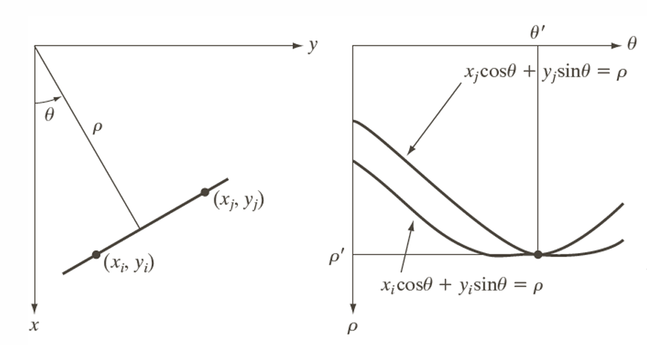
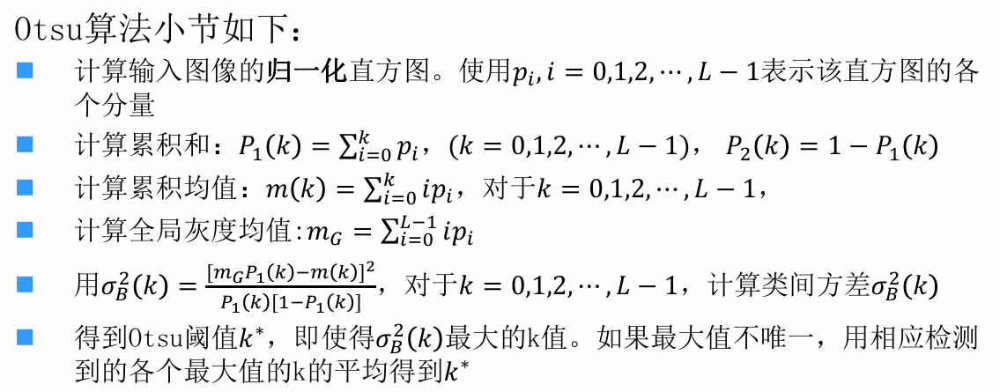
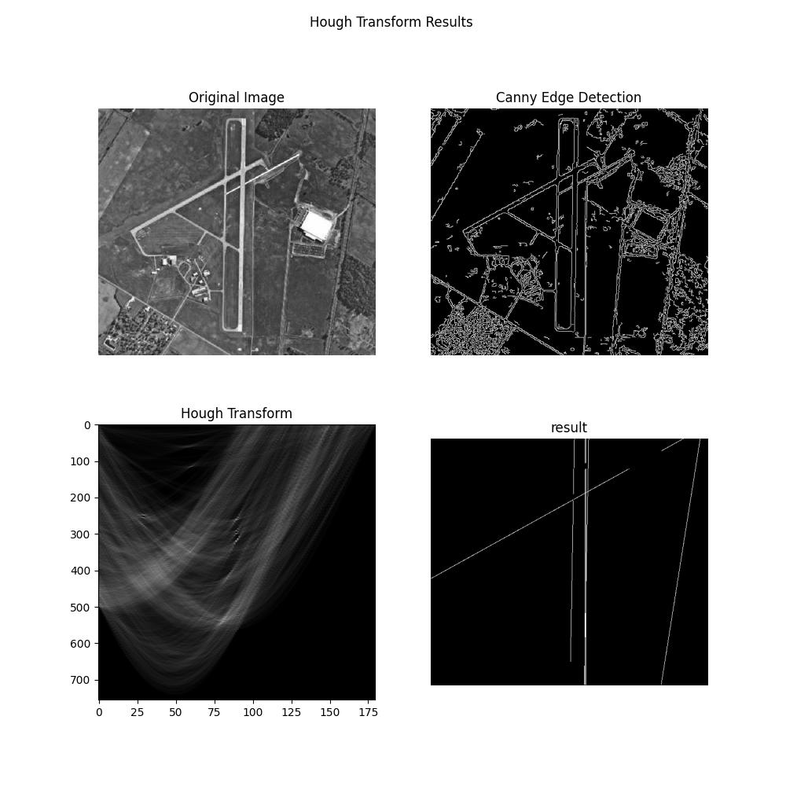
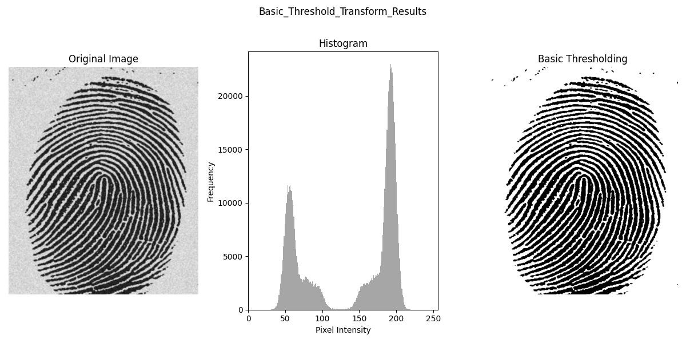
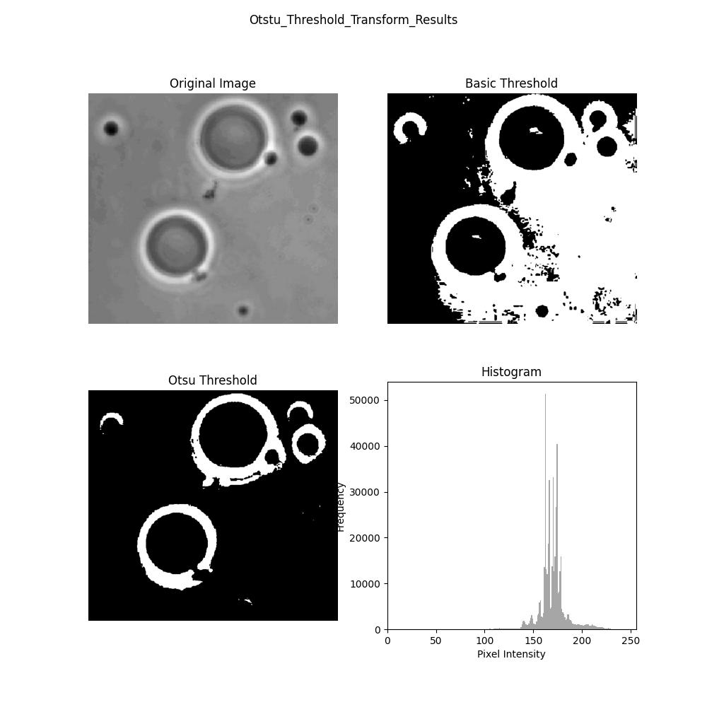
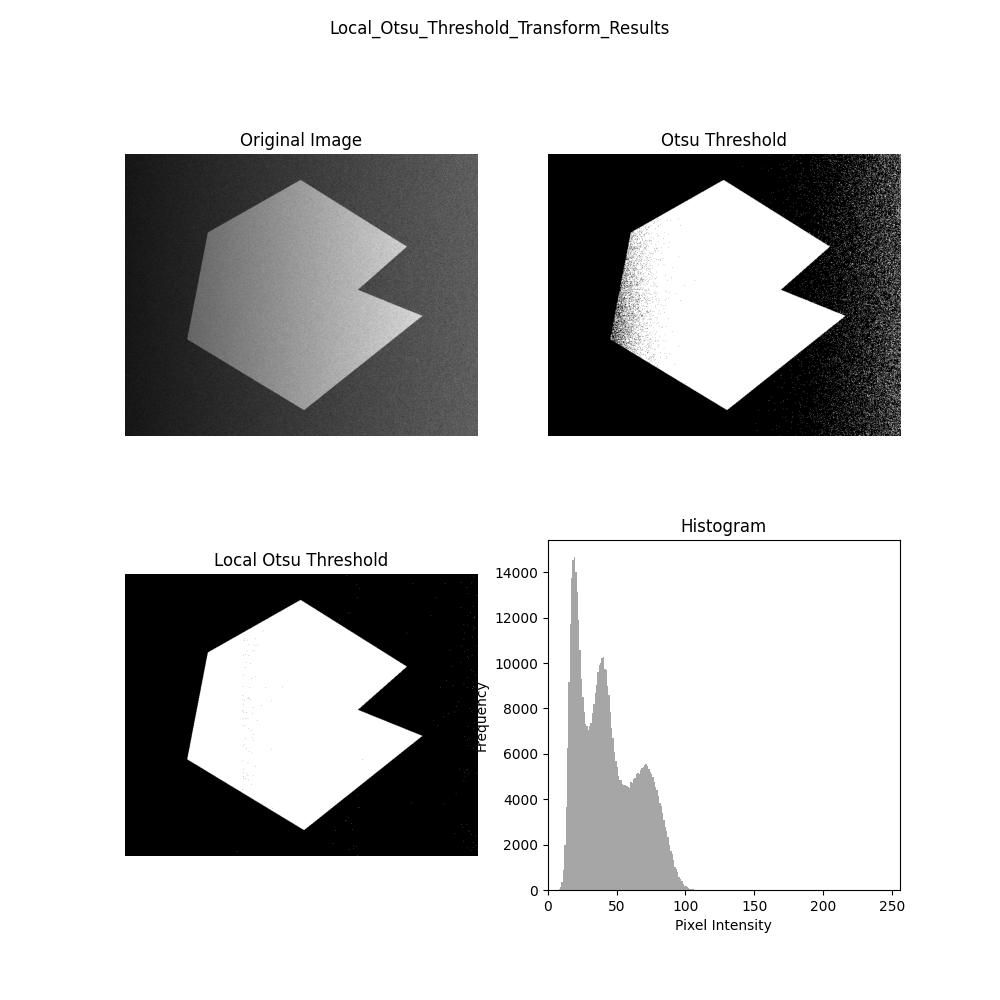

# Report of homework 6, DIP 2024
**PB22061259 刘沛**

## Introduction
这一次的实验任务主要是图像分割，即将图像中感兴趣的区域分割出来。包括边缘、直线提取，以及阈值分割。
- 边缘检测与提取：Canny边缘检测算法。
- 直线提取：Hough变换可以实现对图像当中感兴趣的直线的检测。
- 阈值分割：这里几乎相当于图像的二值化。

## Method
### Hough Transform
如果将图像中的每一个点(x,y)，都看做是一条hough空间中的曲线的参数：
> $\rho = x\cos\theta + y\sin\theta$
会是hough空间中的一条正弦曲线。

注意，如果把$\rho,\theta$看做是参数，那么
> $\rho = x\cos\theta + y\sin\theta$
会是像素空间中的一条直线。

**Hough变换的基本思想是：**
* 像素空间中的一条直线，映射到hough空间，就是一个点。
* 像素空间中的一个点，映射到hough空间，是一条正弦曲线
则，像素空间中的同一条直线上的点$\rho = x\cos\theta + y\sin\theta$，每个(x,y)在hough空间中对应的正弦曲线会相交在一个点$(\rho,\theta)$

在实际的算法当中，我觉得可以有两种思路
#### 1.累加法
类似Radon变换，对一条直线上的所有点进行像素值求和，映射到hough空间中。那么$hough[\rho,\theta]$的值就是这条直线上的所有点的像素值求和，考虑到输入的图像都是进行二值化的、边缘提取的图像，所以$hough[\rho,\theta]$的值可以看做**这条直线通过原图的像素点的个数**

#### 2.交线法
对边缘图像当中不为0的点，进行hough变换，得到hough空间中的曲线。
将这条曲线上的点，完成
>hough[$\rho,\theta$] +=255 ,[$\rho,\theta$]在$\rho = x\cos\theta + y\sin\theta$上
>不在正弦曲线上将保持原样。

这样得到的hough矩阵，和累加法相同，hough[$\rho,\theta$] 越大，说明这条直线经过的点越多。

得到hough矩阵之后，通过设置阈值，如果较多的点共线，那么这条直线将被判定为存在，我们可以找到所有在这条直线上的像素的坐标，后续可以进行边缘连接的操作。

### 基本的全局阈值处理
**算法：**
输入：二值化的图像,$\Delta T$
>
初始化阈值T = img的灰度平均值（1）
用T分割图像，得到low和high两个部分（2）
计算mean_low和mean_high，T_new = (mean_low + mean_high)/2（3）
判断是否收敛：$|T - T_{new}| < \Delta T$;否则重复（2）

### Otsu's Method

灰度图像一般是0,1,2,......255的灰度值。
所有这里有候选的k为255个，我们将计算每一个k对应的类间方差，选出方差最大的k作为阈值。
值得注意的是，分母有可能取0，这里需要排除。

### 局部阈值处理
将图像划分为几个部分，每个部分单独进行Otsu's Method的二值化处理。

## Result
### 直线提取

这里只按照阈值进行直线的提取，没有考虑直线的方向。

### 全局阈值处理

效果对于这种简单的图像还是挺好的。

### Otsu's Method

全局阈值效果一般，但是Otsu's Method的局部阈值处理效果更好。

### 局部阈值处理

对于这种光照不均的图像，直接使用全局阈值处理的效果不可能满足要求，根据图像左暗右亮的先验知识，我们可以将图像分为宽度上的多个个部分，分别进行阈值处理。